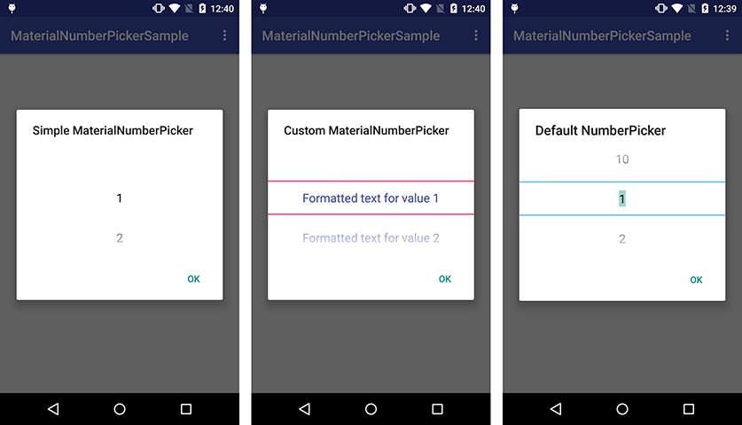

# MaterialNumberPicker
MaterialNumberPicker intends to give you more flexibility than the Holo NumberPicker that only comes with two themes for customization. As many Android developers complained about this component since it was released, this library allows you to access some most wanted private attributes through reflection so that you could easily customize your NumberPicker. Finally, we built on top of it a builder pattern for flexibility reasons.



## Download
MaterialNumberPicker requires at minimum Android 3.0, same as the native NumberPicker.

Gradle:

``
compile 'biz.kasual:materialnumberpicker:1.1.1'
``

Maven:

```
<dependency>
  <groupId>biz.kasual</groupId>
  <artifactId>materialnumberpicker</artifactId>
  <version>1.1.0</version>
  <type>aar</type>
</dependency>
```

Eclipse: [materialnumberpicker-1.1.0.aar](https://github.com/KasualBusiness/MaterialNumberPicker/releases/download/1.1.0/materialnumberpicker-1.1.0.aar)

## Usage

You can build you number picker by using the following example. It gathers the property currently available with its default values:

````
MaterialNumberPicker numberPicker = new MaterialNumberPicker.Builder(context)
                .minValue(1)
                .maxValue(10)
                .defaultValue(1)
                .backgroundColor(Color.WHITE)
                .separatorColor(Color.TRANSPARENT)
                .textColor(Color.BLACK)
                .textSize(20)
                .enableFocusability(false)
                .wrapSelectorWheel(true)
                .build();
```

It is up to you how you want to display the picker. A good practise would be to display it inside an AlertDialog:

````
new AlertDialog.Builder(this)
                .setTitle(yourTitle)
                .setView(numberPicker)
                .setPositiveButton(getString(android.R.string.ok), new DialogInterface.OnClickListener() {
                    @Override
                    public void onClick(DialogInterface dialog, int which) {
                        Snackbar.make(findViewById(R.id.your_container), "You picked : " + numberPicker.getValue(), Snackbar.LENGTH_LONG).show();
                    }
                })
                .show();
```

By default there is no formatter when you build your number picker but you can easily add one using the `formatter` proprety.

## License

```
Copyright 2015 Kasual Business.

Licensed under the Apache License, Version 2.0 (the "License");
you may not use this file except in compliance with the License.
You may obtain a copy of the License at

   http://www.apache.org/licenses/LICENSE-2.0

Unless required by applicable law or agreed to in writing, software
distributed under the License is distributed on an "AS IS" BASIS,
WITHOUT WARRANTIES OR CONDITIONS OF ANY KIND, either express or implied.
See the License for the specific language governing permissions and
limitations under the License.
```
